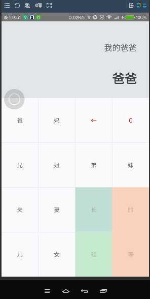

## 亲戚称呼计算器

初涉React Native的入门项目
方便计算亲戚称呼，如下截图所示

#### [Android版下载地址](http://workhard.top/app-release.apk) 

---

#### 近期重启及以后计划：
1. 用ES2015重构及增加较详细注释, 便于初涉React Native同学学习
2. 完善相应IOS版
3. 完善相应的UI界面
4. 重新设计更可行的数据结构承载称呼信息，并相应的完善
6. 2016年春节前上架至Android及IOS相应的应用商店

---

#### 截图：

